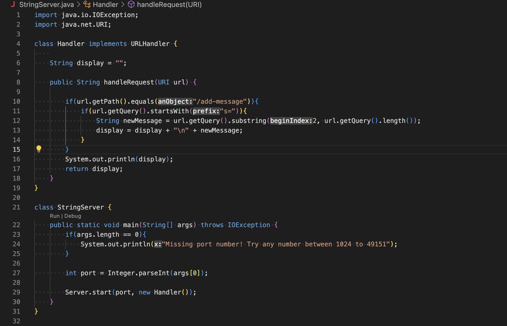

# Lab Report - Week1
I will be demonstrating how to log into course-specific ieng6 account in this tutorial. Since I am using a mac, all the instructions are in accordance with macOS
## VScode
First, we have to install VScode on your laptop. For this go to <https://code.visualstudio.com/docs/setup/mac> and click on **Download Visual Studio Code**.

