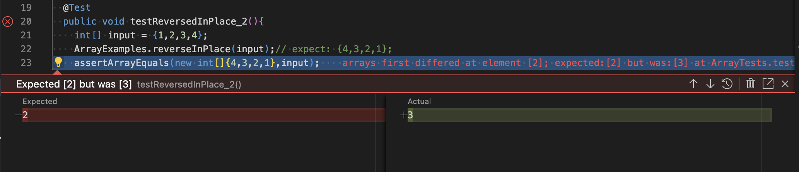

# Lab Report - Week1
I will be demonstrating how to log into course-specific ieng6 account in this tutorial. Since I am using a mac, all the instructions are in accordance with macOS
## VScode
1. First, we have to install VScode on your laptop. For this go to <https://code.visualstudio.com/docs/setup/mac> and click on **Download Visual Studio Code**.

2. In VScode, open the terminal.


## Remotely Connecting
Every student has a cse15l account which is linked to a remote server. Your username would be cs15lsp23zz
1. Reset the password for this account through <https://sdacs.ucsd.edu/~icc/index.php>. Use this tutorial for help - [[TUTORIAL] How to Reset your CSE 15L Password](https://drive.google.com/file/d/17IDZn8Qq7Q0RkYMxdiIR0o6HJ3B5YqSW/view?usp=share_link)
2. After you have changed your password, go to your VScode terminal and enter the following code to login to the remote server\
    ```ssh cs15lsp23zz@ieng6.ucsd.edu```
3. Then you should enter the cs15l course-specific password.
    
    

## Trying some commands
