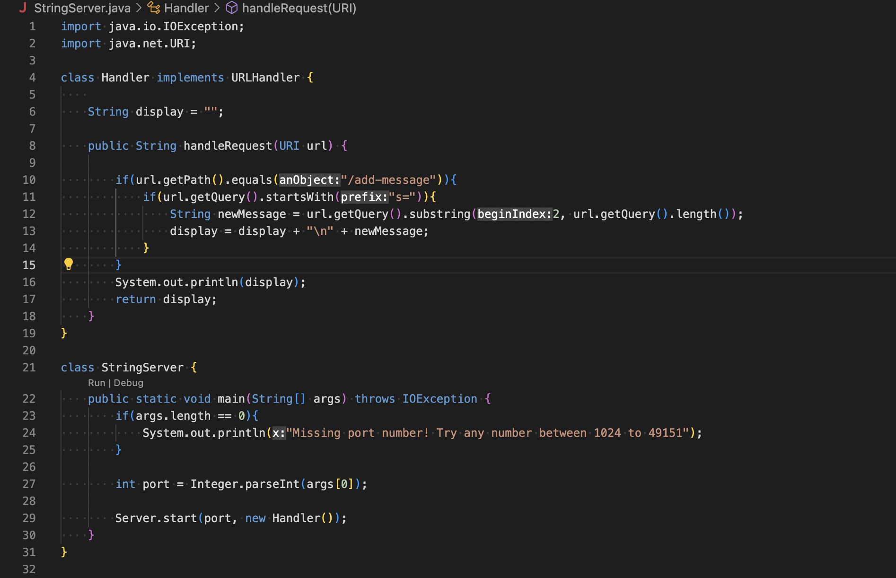
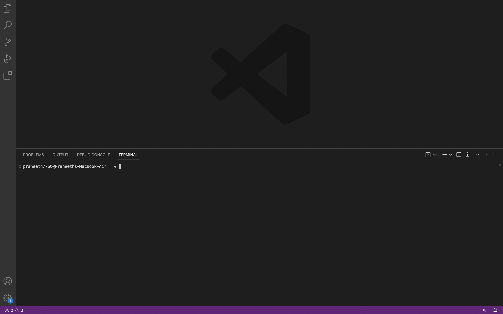
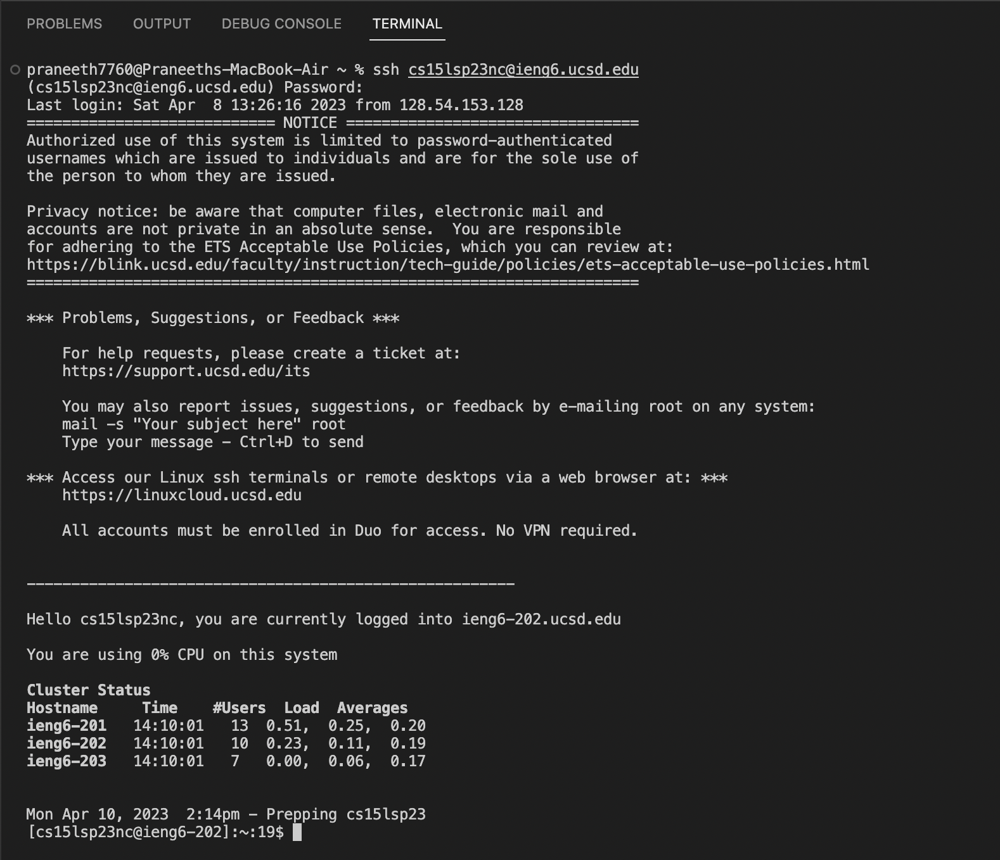

# Lab Report - 2
This lab report contains 3 parts over which I will demonstrate what I have learnt in the past 2 weeks
## Part-1: StringServer.java
1. This creates a web server that updates and prints all the input strings.

2. I created a webserver <http://localhost:7181> for executing a few commands.
 
<http://localhost:7181/add-message?s=CSE15L_LabReport2> displays CSE15L_LabReport2.
* The method ```String handleRequest(URI url)``` is called
* This method takes the URI as an argument. In this case it is <http://localhost:7181/add-message?s=CSE15L_LabReport2>. Initially, the ```display``` field is an empty string. After the method is executed the value of ```display``` field updates to ```CSE15L_LabReport2```.
* For each specific request, the value of ```display``` field might change depending on the path and query. If the path equals ```/add-message```, a string from query gets added to a new line. For example if query equals ```s=RED```. The page would show ```RED```.


<http://localhost:7181/add-message?3+5=8> displays 
``` CSE15L_LabReport2
    3+5=8```
