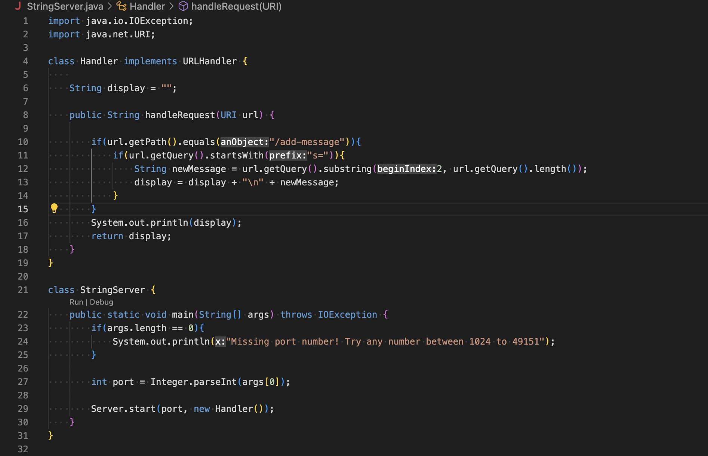
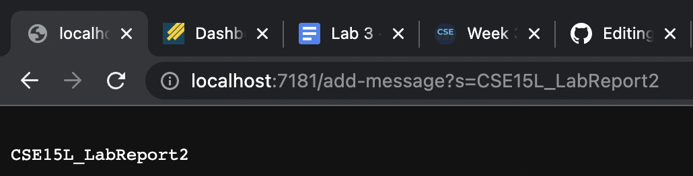
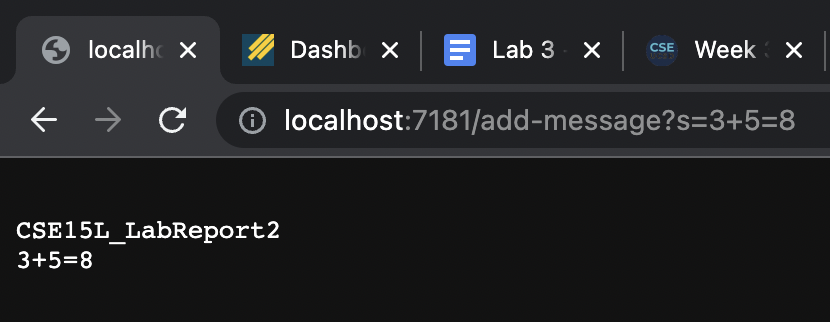
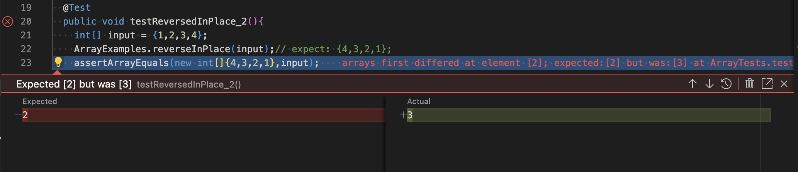
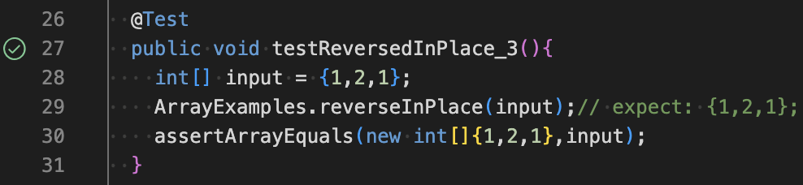

# Lab Report - 2
This lab report contains 3 parts over which I will demonstrate what I have learnt in the past 2 weeks
## Part-1: StringServer.java
1. This creates a web server that updates and prints all the input strings.

2. I created a webserver <http://localhost:7181> for executing a few commands.
 
<http://localhost:7181/add-message?s=CSE15L_LabReport2> displays 
```
CSE15L_LabReport2
```
* The method ```String handleRequest(URI url)``` is called
* This method takes the URI as an argument. In this case it is <http://localhost:7181/add-message?s=CSE15L_LabReport2>. Initially, the ```display``` field is an empty string. After the method is executed the value of ```display``` field updates to ```CSE15L_LabReport2```.
* For each specific request, the value of ```display``` field might change depending on the path and query. If the path equals ```/add-message```, a string from query gets added to a new line. For example if query equals ```s=RED```. The page would show ```RED```.


<http://localhost:7181/add-message?3+5=8> displays 
``` 
CSE15L_LabReport2
3+5=8
```    
* The method ```String handleRequest(URI url)``` is called
*  This method takes the URI as an argument. In this case it is <http://localhost:7181/add-message?s=3+5=8>. Initially, the ```display``` field is ``` CSE15L_LabReport2```. After the method is executed the value of ```display``` field updates to 
```
CSE15L_LabReport2
3+5=8
```
*  For each specific request, the value of ```display``` field might change depending on the path and query. If the path equals ```/add-message```, a string from query gets added to a new line. For example if query equals ```s=RED```. The page would show ```RED```.

## Part-2: Bugs
* For this part I will examine the ```static void reverseInPlace(int[] arr)``` method in ArrayExamples.java file.
* Failure inducing input - {1,2,3,4}. Expected result - {4,3,2,1}. Actual result - {4,3,3,4}.
```
@Test
  public void testReversedInPlace_2(){
    int[] input = {1,2,3,4};
    ArrayExamples.reverseInPlace(input);// expect: {4,3,2,1};
    assertArrayEquals(new int[]{4,3,2,1},input);
  }
```  
* Input that doesn't fail - {1,2,1}. Expected result - {1,2,3}. Actual result - {1,2,1}.
```
  @Test
  public void testReversedInPlace_3(){
    int[] input = {1,2,1};
    ArrayExamples.reverseInPlace(input);// expect: {1,2,1};
    assertArrayEquals(new int[]{1,2,1},input);
  }
```  
 
* In first case it 2 is expected as the 3rd element. Instead the actual 3rd element was 3. The symptom is that the method ```static void reverseInPlace(int[] arr)``` fails to update the second half of the array.
* The actual code
```
static void reverseInPlace(int[] arr) {
    for(int i = 0; i < arr.length; i += 1) {
      arr[i] = arr[arr.length - i - 1]; 
    }
  }
```
Bug: While updating the elements of second half of the array it uses the element of first half which are already updated.\
Fix: In order to fix this issue, we should store the element of the first half in another field and update the element in the first half and later half in the same iteration. So we have to run the for loop only till the halfway mark.
```
static void reverseInPlace(int[] arr) {
    for(int i = 0; i < arr.length/2; i += 1) {
      int temp = arr[i];
      arr[i] = arr[arr.length - i - 1];
      arr[arr.length-i-1]=temp;
    }
  }
```

## Part-3:
Over the weeks 2 and 3, I have learnt the following things
1. Securely copying a file to a remote server using ```scp``` command.
2. Creating a web server and updating it based on the input requests.
3. Getting more comfortable with using GitHub features while coding. Not only for this course but also for CSE12.
4. Finding and fixing bugs by analysing symptoms.
