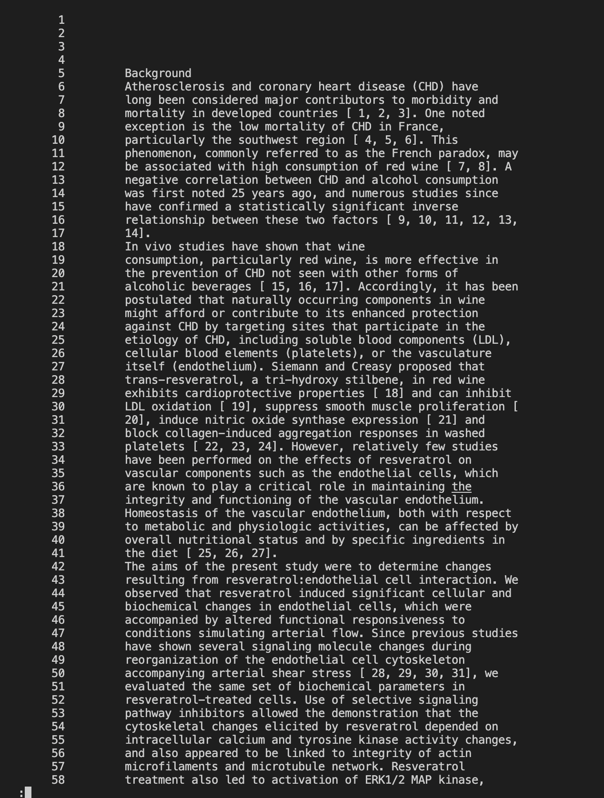
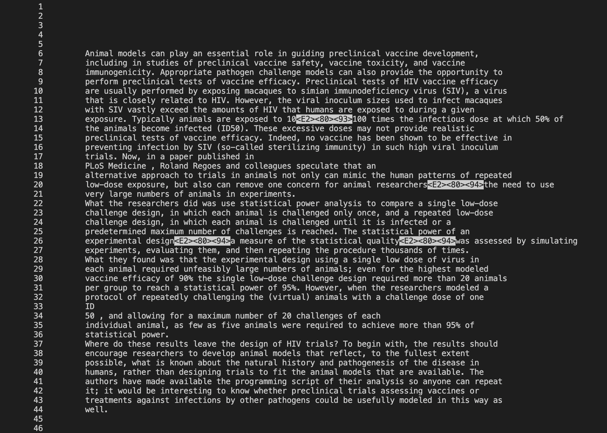

# Lab Report - Week5
## Researching Commands
In this lab report I will be focussing on the `-less` command and its options. 
> `less` command helps us navigate through the contents of a file without loading it to the memory completely. We view the contents page by page. Additional benefit of `less` command is that it doesn't print the contents of the file in the terminal.
> We can exit navigating through the contents of the file by entering `q`.
> Pressing space bar takes us to the next page in the contents.
> It's syntax is `less [file path]`.

There is a variety of options available for `-less` command which can be really helpful tools.

### Command option 1: `less -N`
> `less -N` displays the line numbers on the left
> This option can be helpful for keeping track of lines.

* **Example1:** 
Lets try running this command.
```
less -N biomed/1471-2121-2-1.txt
```


* **Example2:** 
Now we will try the same command on a smaller file.
```
less -N plos/pmed.0020258.txt
```

### Command option 2: `less --chop-long-lines`
> `less --chop-long-lines` option chops long lines so that the line fits on the page.
> removes part of the line that extends longer than the width of the terminal.
+ **Example1:** 
Let's run this command:
```
less --chop-long-lines plos/pmed.0020275.txt
```
The outputs is: 
```
 Dementia remains an incurable condition and its increasing prevalence is a deeply
        worrying aspect of the “graying” of the population. An important question for researchers
        is to establish whether dementia incidence, prevalence, and national history vary from one
        location to another. Incidence studies are particularly valuable for less biased comparison
        of disease occurrence, as well as being essential for policy makers. Many biases can,
        however, be introduced in such studies. Dropout and mortality are particular reasons for
        concern.
        Most of the numerous studies of dementia incidence have been restricted to single sites.
        Authors have frequently attempted to assess whether rates in a given study are similar to
        those obtained elsewhere. However, variations between studies in the methodology employed
        make such comparisons unreliable. Where within-country variations in incidence have been
        noted, as has happened in the US, they have often been ascribed to methodological
        differences, but one cannot be certain whether this is the case.
        Risk factors for other chronic disorders common in old age (notably cardiovascular
        disease and cancers) do vary in their prevalence between and within countries. In the UK,
        for example, the incidence of stroke is known to vary considerably across the country. A
        high proportion of dementia patients are thought to have a vascular component to their
        dementia, and it has been assumed that dementia incidence could be reduced if vascular risk
        were better controlled. One way to test this hypothesis is to compare sites with known
        variation in vascular risk to assess whether there is also variation in the incidence of
        dementia.
        The Medical Research Council Cognitive Function and Ageing Study (MRC CFAS) is a
        multi-site, population-based study in the UK of individuals aged 65 years and over living
        in the community, including institutions. Diverse sites have been chosen, with varying
        exposures of potential importance in dementia. A two-phase two-wave design has been
        employed, with the waves two years apart. A standard set of instruments for the diagnosis
        of dementia is used throughout. CFAS now publishes incidence estimates from five sites,
        using likelihood-based methods to compare the first two waves of interviews.
        Predictably, incidence rates of dementia, for both sexes, were found to rise with age,
        from 6.7 per 1,000 person years at age 65–69 years to 68.5 per 1,000 person years at age 85
        years and above. The authors estimate that around 163,000 new cases of dementia occur in
        England and Wales each year. However, there was no convincing evidence of variation across
        sites, and the incidence rates do not reflect the variations in the prevalence of possible
        risk factors in these sites. We therefore cannot assume that action to reduce vascular risk
        will have a significant impact on dementia incidence.
        Another issue addressed by the study is previous suggestions in the literature that
        dementia incidence rates might be lower in the oldest age groups. The limited number of
        respondents in these age groups in previous studies made it impossible to test this
        hypothesis. The CFAS, however, found no evidence of any such tailing off in incidence,
        which also has implications for policy and planning.
        The CFAS is important because it provides the first multi-site comparison of incidence
        rates in ethnically homogeneous populations within a country, and within Europe, using
        identical methodology across sites. The methodological approach developed for the study
        will also be of value for researchers undertaking other studies of dementia incidence, and
        in other chronic disease studies involving a two-phase selection process.
      
```

+ **Example2:**
Let's run this command on a different file:
```
less --chop-long-lines plos/pmed.0020274.txt
```
The output is:
```
 
        The World Health Organization estimates that about 20% of all deaths in children younger
        than five years old are due to acute lower respiratory tract infections (LRTIs), with 90%
        of these deaths due to pneumonia. But despite LRTIs being among the most frequent diseases
        in the first years of life, the viral causes of these illnesses are not always clear.
        Several viruses are known to be involved, e.g., respiratory syncytial virus (RSV),
        influenza viruses, parainfluenza viruses, and human metapneumovirus, but none of these
        pathogens is detected in a substantial number of cases.
        In a new article published in 
        PLoS Medicine , Lia van der Hoek and colleagues investigate the
        association of acute LRTIs with human coronavirus HCoV-NL63, a virus they recently
        described. They suggest that HCoV-NL63, a new member of the Coronaviridae family, is one of
        the most frequently detected viruses in children less than three years old with LRTIs and
        that this virus is strongly associated with croup.
        The team analyzed samples from the PRI.DE study, a prospective population-based study of
        LRTIs in children younger than three years old in Germany. They assessed by PCR 949 samples
        of nasopharyngeal secretions from children with LRTIs.
        In all, 49 samples (5.2%) were positive for HCoV-NL63 RNA. Viral RNA was more prevalent
        in samples from outpatients (7.9%) than hospitalized patients (3.2%), and co-infection with
        either RSV or parainfluenza virus 3 was observed frequently. With an overall occurrence of
        5.2%, HCoV-NL63 was the third most frequently detected pathogen in this patient group (RSV
        was the highest, found in 31.4% of samples). The researchers focused on HCoV-NL63 in cases
        of respiratory disease where no other viral pathogen could be detected in order to identify
        clinical symptoms associated with HCoV-NL63 infection. Samples in which only HCoV-NL63 RNA
        could be detected had a significantly higher viral load than samples containing additional
        respiratory viruses. A strong association with croup was apparent: 43% of the
        HCoV-NL63-positive patients with high HCoV-NL63 load and absence of co-infection had croup,
        compared with 6% in the HCoV-NL63-negative group. Indeed, a significantly higher fraction
        (17.4%) of samples from croup patients than non-croup patients (4.2%) contained HCoV-NL63
        RNA.
        This study strengthens the evidence for the role of HCoV-NL63 in croup. Previous studies
        have shown croup to occur mostly in boys, with peak occurrence in the second year of life
        and predominantly in the late autumn or early winter season. And HCoV-NL63 infection seems
        to follow these trends, said the authors.
        However, the authors warned that the high percentage of HCoV-NL63-positive samples could
        be due to a strong viral activity in the study year, and long-term studies are needed to
        determine whether HCoV-NL63 infections occur in cycles peaking every two to three years, as
        observed for other respiratory viruses. But they noted that HCoV-NL63 has spread worldwide,
        with the virus found in Australia, Canada, Japan, Belgium, and the US. Thus, health
        authorities should add HCoV-NL63 to the list of pathogens that can cause numerous LRTIs in
        young children.
      
```

  
### Command option 3: `less -p "<any word>"`
> `less -p` option will search for the pattern from the given specified word.
> the pattern starts when the first word is found.
+ **Example1:** 
Let's try running this on a smaller file:
```
```
The output is:
```
        alternative approach to trials in animals not only can mimic the human patterns of repeated
        low-dose exposure, but also can remove one concern for animal researchers—the need to use
        very large numbers of animals in experiments.
        What the researchers did was use statistical power analysis to compare a single low-dose
        challenge design, in which each animal is challenged only once, and a repeated low-dose
        challenge design, in which each animal is challenged until it is infected or a
        predetermined maximum number of challenges is reached. The statistical power of an
        experimental design—a measure of the statistical quality—was assessed by simulating
        experiments, evaluating them, and then repeating the procedure thousands of times.
        What they found was that the experimental design using a single low dose of virus in
        each animal required unfeasibly large numbers of animals; even for the highest modeled
        vaccine efficacy of 90% the single low-dose challenge design required more than 20 animals
        per group to reach a statistical power of 95%. However, when the researchers modeled a
        protocol of repeatedly challenging the (virtual) animals with a challenge dose of one 
        ID
        50 , and allowing for a maximum number of 20 challenges of each
        individual animal, as few as five animals were required to achieve more than 95% of
        statistical power.
        Where do these results leave the design of HIV trials? To begin with, the results should
        encourage researchers to develop animal models that reflect, to the fullest extent
        possible, what is known about the natural history and pathogenesis of the disease in
        humans, rather than designing trials to fit the animal models that are available. The
        authors have made available the programming script of their analysis so anyone can repeat
        it; it would be interesting to know whether preclinical trials assessing vaccines or
        treatments against infections by other pathogens could be usefully modeled in this way as
        well.
```
+ **Example2:** 
Let's run this on a larger file:
```
less -p "Conclusion" biomed/1468-6708-3-1.txt
```
The output is:
```
        Conclusion
        Recommendations for desirable weight have been
        criticized for emphasizing mortality rather than health. We
        found associations between YHL and obesity that were not
        present in the mortality analysis, suggesting that YHL may
        be a more sensitive measure of the burden of obesity in
        older adults, especially for women. Future efforts to
        determine desirable weight guidelines should include
        measures of YHL. Using either YOL or YHL, however, we found
        no excess risk for older adults who would be classified as
        'overweight' by the NHLBI guidelines. This suggests using
        YHL as the outcome measure in clinical trials involving
        obese or underweight older adults, and discouraging trials
        that address older adults who are merely overweight.
      
      
        Competing interests
        None declared
      
      
        Abbreviations
        BMI Body mass index
        CESD Center for Epidemiologic Studies Depression
        Scale
        CHS Cardiovascular Health Study
        EVGFP Is your health excellent, very good, good, fair or
        poor?
        QALY Quality-adjusted life years
        YHL Years of healthy life
        YOL Years of life
      
```
### Command option 4: `less -S long_file.txt`
> `less -S` option truncates long lines so that they fit within the width of the terminal.
> prevents lines from wrapping.
+ **Example1:** 
Let's run this on a larger file:
```
```
The output is:
```

```
+ **Example2:** 
Let's run this on a larger file:
```
```
The output is:
```

```

