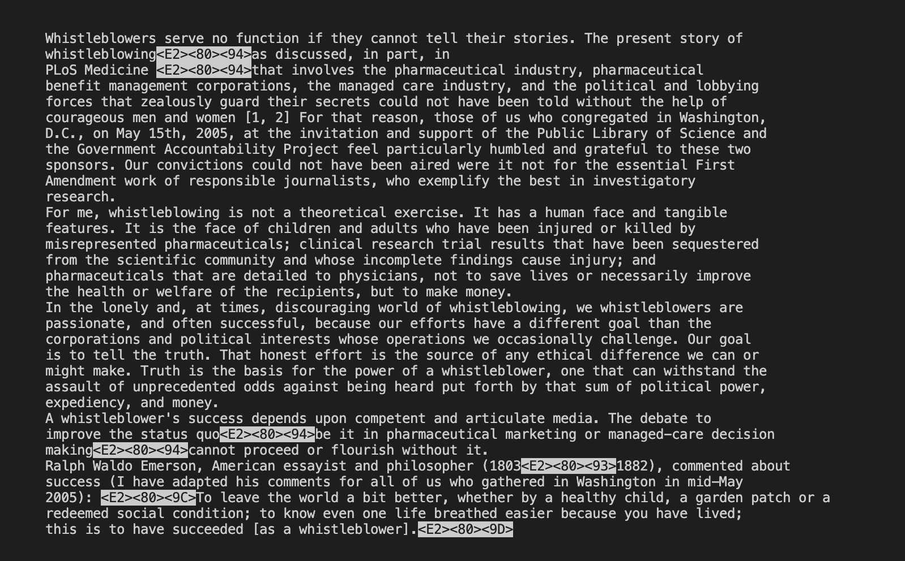

# Lab Report - Week5
## Researching Commands
In this lab report I will be focussing on the `-less` command and its options. 
> `less` command helps us navigate through the contents of a file without loading it to the memory completely. We view the contents page by page. Additional benefit of `less` command is that it doesn't print the contents of the file in the terminal.
> We can exit navigating through the contents of the file by entering `q`.
> Pressing space bar takes us to the next page in the contents.
> It's syntax is `less [file path]`.

There is a variety of options available for `-less` command which can be really helpful tools.

### Command option 1: `less -N`
> `less -N` displays the line numbers on the left
> This option can be helpful for keeping track of lines.

* **Example1:** 
Lets try running this command.
```
less -N biomed/1471-2121-2-1.txt
```


* **Example2:** 
Now we will try the same command on a smaller file.
```
less -N plos/pmed.0020258.txt
```

### Command option 2: `less --chop-long-lines`
> `less --chop-long-lines` option chops long lines so that the line fits on the page.
> removes part of the line that extends longer than the width of the terminal.
+ **Example1:** 

The outputs is:


When running the command with option, we can open the file directly.


+ **Example2:**
  
### Command option 3: `less -p "<any word>"`
> `less -p` option will search for the pattern from the given specified word.
> the pattern starts when the first word is found.
```
```
### Command option 4: `less -S long_file.txt`
> `less -S` option truncates long lines so that they fit within the width of the terminal.
> prevents lines from wrapping.
```
```

