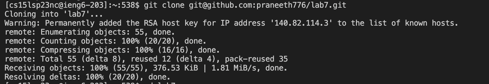

# Lab Report4 - Week7

## Timing Tasks
1. ### Log into ieng6. 

    Keys pressed: `ssh cs15lsp23nc@ieng6.ucsd.edu`,`<enter>`.        
    .   
    Since, I have already generated ssh keys for ieng6, I don't have to enter password when logging in from my laptop anymore.

2. ### Clone your fork of the repository from your Github account

    Keys pressed: `git clone git@github.com:praneeth776/lab7.git`,`<enter>`.   
    . 
    
    > Note: We have to use the ssh url to clone the respiratory rather than the https url. If we use the https url, we would not be able to push or commit our changes to the respiratory from our ieng6 account.    
    
    Now I have cloned my fork of the lab7 respiratory.

3. ### Running tests.

      Keys pressed:       
          1.   `cd lab7`,`<enter>`- changes the working directory to lab7.   
          2.   `javac -cp .:lib/hamcrest-core-1.3.jar:lib/junit-4.13.2.jar *.java`,`<enter>`- compiles the junit tester.    
          3.   `bash test.sh`,`<enter>` - runs the tests in ListExamplesTests class using test.sh .
      .  
      
      1 test fails. Now we have to fix the bug in ListExamples.java file.

4. ### Fixing the bug. 

      Keys pressed:       
          1. `vim ListExamples.java`,`<enter>` - opens the ListExamples.java using vim editor.   
          2. `Ctrl+d`,`Ctrl+d`,`<up>`,`<up>`,`<up>`,`<up>`,`<up>`,`<up>`,`<l>`,`<l>`,`<l>`,`<l>`,`<l>`,`<l>`,`<l>`,`<l>`,`<l>`,`<l>`,`<l>`,`<l>`,`<l>` - places the cursor after `index1` on line44.        
          3. `i`,`backspace`,`2` - enters insert mode and edits `index1` to `index2`.     
          4. `<esc>` - to exit insert mode.   
          5. `:wq` - to save and exit ListExamples.java file.       
     .     
     
     By following these steps, we fix the bug in line 44 of ListExamples.java file.    

5. ### Running tests again.     

      Keys pressed:      
          1. `<up>`,`<up>`,`<up>`,`<enter>` - The command to compile the junit tester was 3 up in the history. So I used this to access it.     
          2. `<up>`,`<up>`,`<up>`,`<enter>` - The command `bash test,sh` was 3 up in the history. So I used this to access it.     
      
      .  
      
      Now the tests run succesfully.   
    
6. ### Commiting and pushing these changes to my respiratory.
      Keys pressed:      
          1. `git add .`,`<enter>` - This command adds all the changes made to all the files in that respiraoty.     
          2. `git commit -m "Bug Fixed!!"`.   
          3. `git push` - This command pushes all the changes to the respiratory.      

      .   
      
      Now we have pushed the changes we made to the respiratory.    

   
