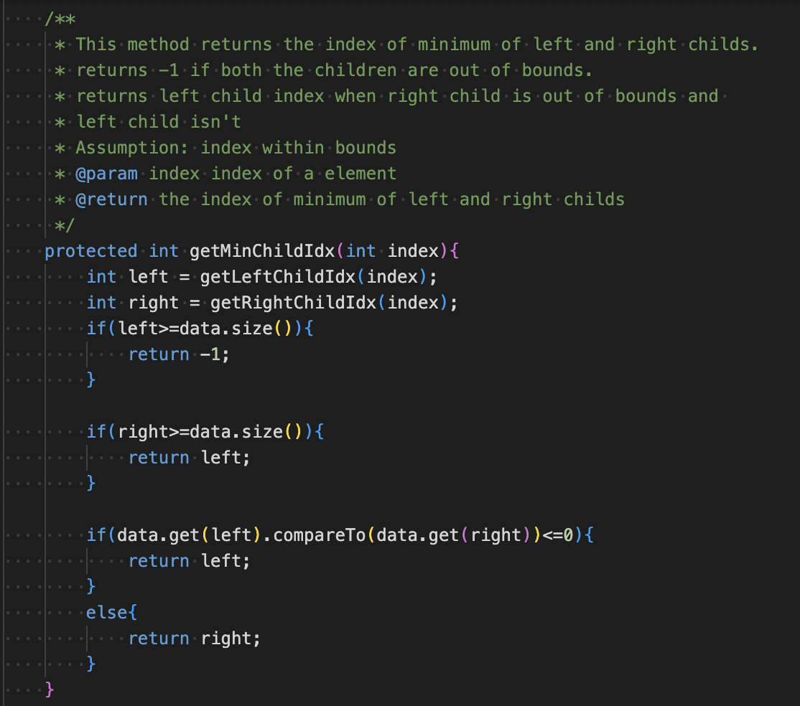
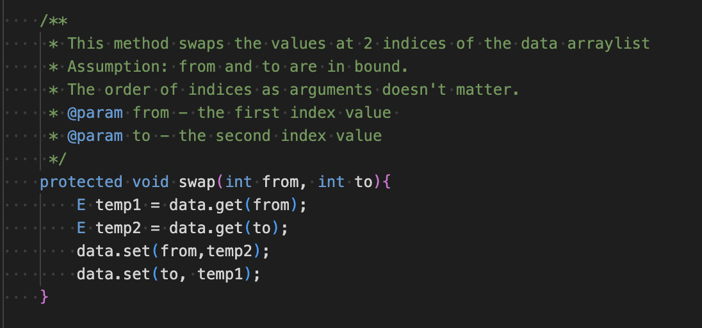
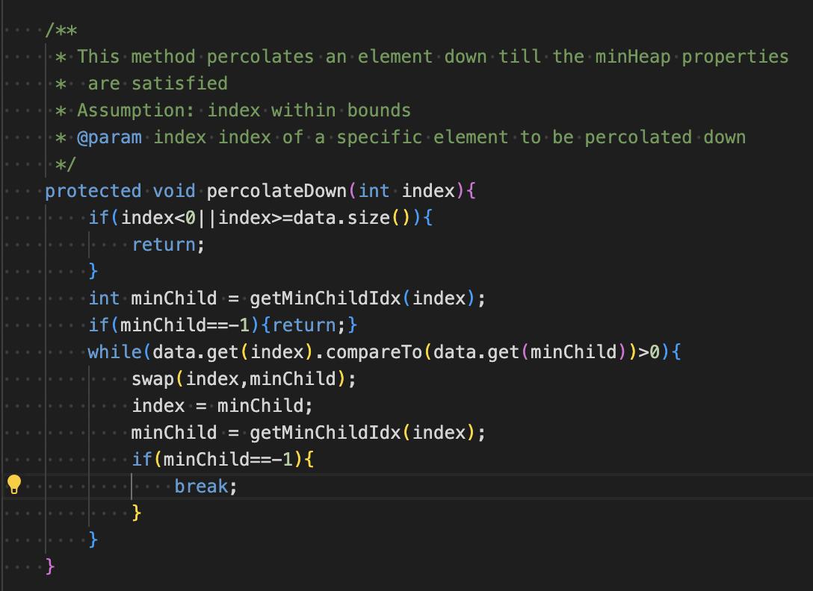
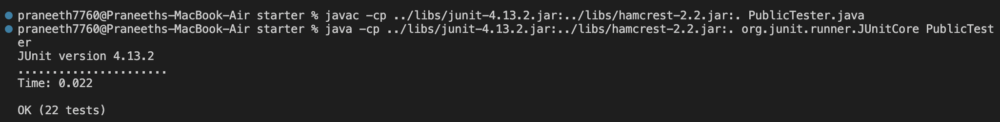

# Lab Report5 - Week9

In this lab report, I will be playing the role of both the student and the TA. The student will post a bug in his code with the necessary details. The TA uses these details to debug the code and explain it to the student.  

## Part1 - Student's Bug

**What environment are you using (computer, operating system, web browser,terminal/editor, and so on)?**


I am using a MacBook with macOS operationg system and VSCode editor for editing the code.

**Detail the symptom youʼre seeing. Be specific; include both what youʼre seeing and what
you expected to see instead. Screenshots are great, copy-pasted terminal output is also
great. Avoid saying “it doesnʼt work”.**

For PA7 MinHeap and Priority queue, the method percolateDown() has a bug. It says that the index is out of bounds and all the other methods which call percolateDown(). I expect to not get any errors in the execution of the code.     
Here is the screenshot and the JUnit test result.    
### Code:


### Terminal output:

```
3) testMinHeapPercolateDown(PublicTester)
java.lang.IndexOutOfBoundsException: Index -1 out of bounds for length 5
        at java.base/jdk.internal.util.Preconditions.outOfBounds(Preconditions.java:100)
        at java.base/jdk.internal.util.Preconditions.outOfBoundsCheckIndex(Preconditions.java:106)
        at java.base/jdk.internal.util.Preconditions.checkIndex(Preconditions.java:302)
        at java.base/java.util.Objects.checkIndex(Objects.java:359)
        at java.base/java.util.ArrayList.get(ArrayList.java:427)
        at MyMinHeap.percolateDown(MyMinHeap.java:152)
        at PublicTester.testMinHeapPercolateDown(PublicTester.java:131)
```

**Detail the failure-inducing input and context. That might mean any or all of the command
youʼre running, a test case, command-line arguments, working directory, even the last few
commands you ran. Do your best to provide as much context as you can.**

I have several other test failures which use percolateDown() method. The other method calls I have used in percolateDown() are shown below.





## TA's debugging

I have noticed a few errors in your code. Since, the method getMinChildIdx() works on the assumption that index is within bounds and doesnot regulate the output to be within bounds. There is a possibility that the output can be -1 for getMinChildIdx() method. So percolateDown() has to account for this exception outcome of getMinChildIdx() method. So you have to constantly check the if the output of getMinChildIdx() is within bounds.

## Revised code after debugging:

After finding the bug of getMinChildIdx() method, I have fixed the percolateDown() method. I have checked if the output of getMinChildIdx() is within bounds every time I call the method. If the output index is out of bounds I set the percolateDown() method to break out of the while loop.
Here is the revide code after debugging





## 

## Part2 - Reflection

CSE15L course was really fun and engaging course this quarter. I have enjoyed the lectures and labs a lot. This course was very different from the other CSE courses I have taken so far. While the other CSE courses focussed primarily on learning programming languages and algorithms, CSE15L has focussed on the other ascpects like terminal commands, github, bashscript.
